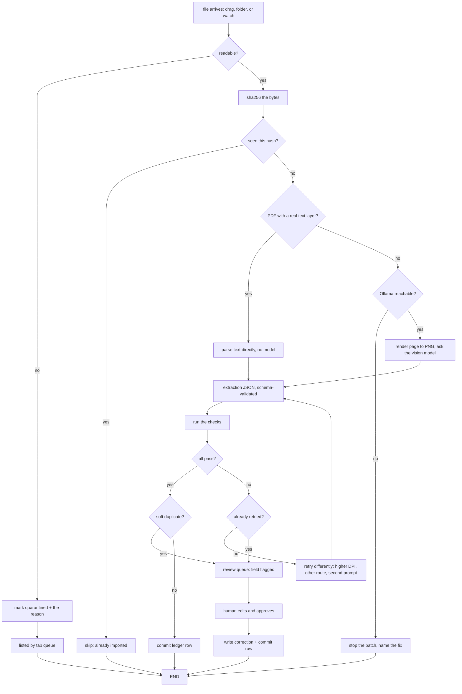

# App flow — TAB

Every step and every branch, including the ones people skip when they write
these documents: the empty state, the first run, the thing that will not open,
and the moment the model is not there.

---

## 1. The whole path



Every decision node writes one row to `decisions` with the reason in plain words.
That is what the demo shows.

## 2. First run

Nothing exists yet: no database, no inbox folder, no model pulled.

1. `tab ingest ./receipts` creates the database on first use, silently. No setup
   step, no init command to forget.
2. If the vision path is needed and Ollama is not reachable, it stops **before**
   processing anything and prints the exact command to fix it. It does not
   process nineteen receipts and then fail on the twentieth.
3. If the vision model is not pulled, same treatment: name the model, name the
   `ollama pull` command, stop.

The guard goes at the top, where it costs ten seconds, not at the bottom where it
costs the whole batch.

## 3. The command sequence

```bash
python -m tab ingest ./receipts        # a file or a folder; safe to re-run
python -m tab watch ./inbox           # unattended: read on arrival, surface exceptions
python -m tab review                  # opens 127.0.0.1:8000, the queue
python -m tab queue                   # the same list, in the terminal
python -m tab export --csv ledger.csv # the rows that passed

python -m tab.eval --corpus cord --split test   # the four metrics, as JSON
```

`eval` is not a subcommand of `tab`. It is a separate module because it reads a
labelled corpus rather than a ledger, and nothing in the shipped program depends
on it.

Each stage, what it eats and what it emits:

| stage | consumes | emits |
|---|---|---|
| `ingest` | image or PDF paths | `documents`, `extractions`, `checks` rows; committed `receipts` or queue entries |
| `review` | queue entries | corrected `receipts` rows, `corrections` rows |
| `export` | committed `receipts` | a CSV a spreadsheet opens without editing |
| `watch` | a folder, polled | same as `ingest`; only what needs a person is printed |
| `eval` | a labelled corpus | `results/scoreboard-<corpus>-<split>.json` — the four metrics with sample sizes |

## 4. The review screen

The only screen with real interaction, and the one people judge the tool on.

**Layout.** Receipt image on the left at full readable size. Extracted fields on
the right as an editable form. The failing check sits between them as a plain
sentence, not a code.

**What a flag looks like.** Not "confidence 0.62". It says:

> Items add up to ₱1,190.00 but the receipt says ₱1,240.00. Difference: ₱50.00.

That sentence is generated from the check, so it cannot drift from the logic.

**Interaction.** The flagged field is focused on load. Tab moves through the
fields in reading order. Enter approves. The keyboard alone is enough — someone
clearing forty receipts will not reach for a mouse.

**Line items** are editable too — quantity, unit price and amount. The
description is not, because nothing checks it and an input there only invites
typing over the evidence. When `line_math` fails it is the offending line that
is highlighted and focused, not the subtotal: on a receipt whose third line
reads ₱80.00 where 3 × ₱30.00 is ₱90.00, the subtotal is the number that is
*right*, and sending someone to it walks them into breaking it.

**On approve:** the row is committed, each edit is written to `corrections`
(headers by name, lines as `line 3 amount`), and the next queue item loads
without a page change.

**On discard:** the document is marked not-a-receipt or duplicate, and never
appears again. Nothing is deleted from disk.

## 5. The states people forget

| state | what the user sees |
|---|---|
| **Empty queue** | "Nothing needs you." plus the last run summary — how many went through untouched. This is the success state and it should look like one. |
| **Empty ledger, first run** | one line explaining what to drag in, and nothing else on screen |
| **Loading** | per-document progress with the current filename, because a vision pass on a big batch is slow and silence reads as a hang |
| **Ollama missing** | the exact command to start it; the queue and the ledger still work, only new vision extractions are blocked |
| **Not a receipt** | queued as such, one click to discard, never silently deleted |
| **Foreign currency** | queued with the currency shown; never converted |
| **Exact duplicate** | skipped by file hash, saying so: "already imported, skipped" |
| **Soft duplicate** | held, naming the twin: "looks like receipt #12: same merchant, date and total". Correcting a receipt *into* a duplicate is caught the same way and asks before filing both |
| **Unreadable file** | marked quarantined in the ledger with the reason. **Nothing is moved.** The file stays where the user put it, because a tool that rearranges someone's folders is a tool they stop trusting |
| **Offline** | everything works; there is nothing to be offline from |
| **Mid-batch crash** | committed rows stand, re-running skips them by hash |

## 6. Unattended mode

The mode the project actually exists for. A folder is watched; each arriving file
runs the same path. Anything that passes its checks lands in the ledger with
nobody watching. Anything that fails lands in the queue.

Success is measured by absence: the user opens TAB rarely, and when they do there
are three receipts waiting rather than forty.

## 7. The public page

Not the app. A static replay of a real run, with no uploader and no model:

1. A receipt appears, the row builds, one field lights up as flagged — the ten
   second story.
2. Below it, the scoreboard: straight-through rate and silent error rate side by
   side, each with its sample size and the corpus named.
3. Below that, what it cannot do, with the measured failure rate where one exists.

The page renders committed logs and generated scoreboard JSON. It has no model in
it, so it cannot disagree with the study.
